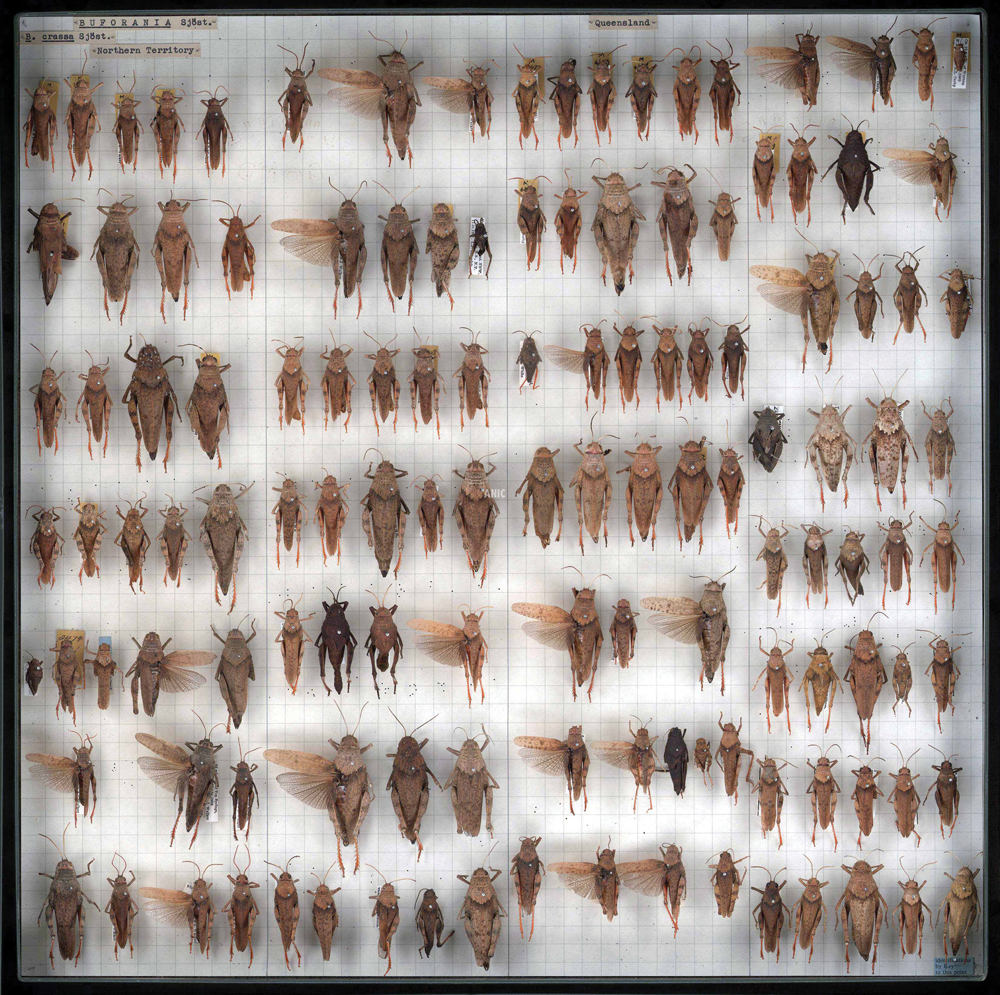

# Insect detector demo

Quick online showcase of an insect finder based upon the [YOLOv8 architecture](https://github.com/ultralytics/ultralytics). This demo allows you to upload a demo image for annotation (see sample image).

It demonstrates the high accuracy of finding insects in/on institutional collection drawers, allowing for quick inventory creation (counts) of collections.

This demon only considers the presence or absence of any insect, not the type of insect in the image. Improvements of the model in this direction can be made, but requires more annotation data (labels). Curently only 16 drawers were used across different orders to train a simple (nano scale) YOLOv8 model (in order to support it to run in a browser). A larger model attained higher accuracies but is not compatible with an online demo.

## Acknowledgements

All credit for the react based webpage goes to Wahyu Setianto, with minor
changes and automated deployment mine.

## Sample image reference

Mantle et al. (2012). "Whole-drawer imaging for digital management and curation of a large entomological collection". ZooKeys 209: 147. DOI:10.3897/zookeys.209.3169.
